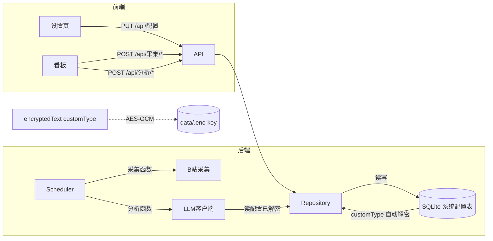

## 用户需求

抛弃项目目录下所有 `.env` 相关文件，LLM 配置改为在前端"系统配置"页填写、存入服务端数据库，且密钥必须加密存储（不可明文落盘）。移除自动分析流程，将数据看板改造为细分的手动操作按钮，便于分环节 debug。

## 产品概述

一个 B站舆情监控系统（Vue3 前端 + Hono/SQLite 后端）。当前 LLM 密钥配置前后端断开（前端只存 localStorage，后端只读 .env），导致填了密钥后端仍报错；采集与分析耦合在定时任务里，无法单独触发。

## 核心功能

- **配置数据库化**：设置页填写 → 存 SQLite → 服务端读取；密钥类字段加密存储；删除 `.env`/`.env.example`/`dotenv` 依赖
- **采集分析解耦**：拆掉"采集后自动分析"，改为各自独立的手动按钮
- **数据看板按钮化**：采集组（采集视频/采集评论/采集动态/一键采集全部）+ 分析组（分析未处理评论/重新分析全部评论），每个按钮独立 loading 与结果反馈
- **配置安全**：密钥字段在 API 返回时仅给"是否已配置"布尔值，不回显明文；保存时空值保留原密钥

## 技术栈

- 后端：Hono + drizzle-orm/bun-sqlite + bun:sqlite（现有）
- 加密：Node 内置 `crypto`（AES-256-GCM），通过 drizzle `customType` 封装为 `encryptedText()` 列类型，零新依赖
- 前端：Vue3 + Element Plus + TypeScript（现有）
- 迁移：现有 `bun run --filter server db:推送`（drizzle-kit push）

## 实现方案

### 加密设计（核心）

新增 `server/src/db/encrypted.ts`，用 drizzle `customType` 定义 `encryptedText()`：

- 模块加载时读取主密钥 `data/.enc-key`（32 字节随机），不存在则 `crypto.randomBytes(32)` 生成并写入文件，主密钥缓存于内存
- `toDriver(明文)` → `enc:` + base64(`iv:密文:authTag`)，同步用 `createCipheriv`
- `fromDriver(密文)` → 明文，同步用 `createDecipheriv`；非 `enc:` 前缀的值视为旧明文直接返回（向前兼容）
- `系统配置` 表的 `值` 列统一用 `encryptedText()`——所有配置值都加密存（连模型名/地址也加密，安全性最高且实现统一）

customType 的 `toDriver`/`fromDriver` 是同步签名，AES-256-GCM 的 `createCipheriv`/`createDecipheriv` + `update`/`final` 也是同步 API，二者完全兼容，无需改 drizzle 调用方式。

### 配置存储与读取

- `系统配置(键 text PK, 值 encryptedText, 更新时间 integer)` 键值对表，灵活承载 LLM 配置 + 采集参数
- `读取配置(提供商)` 改为 async，从 DB 读出（customType 已自动解密为明文），密钥为空则抛错
- `GET /api/配置`：非密钥字段返回明文值；密钥字段返回 `xxx密钥已配置: boolean`，绝不回显明文/密文
- `PUT /api/配置`：密钥字段传空字符串则跳过（保留原值），传值则覆盖（customType 自动加密）

### bootstrap 项处理

端口(5160)、数据库路径(./data/monitor.db)、B站凭证路径(./data/bili-凭证.json) 在连库前就要用到，无法入库——用代码默认值 + 仍支持 `process.env` 命令行覆盖（如 `端口=8080 bun run dev`），但删除 `dotenv/config` 后不再读任何 `.env` 文件。

### 采集/分析拆分

- `scheduler/index.ts` 导出独立函数：`采集视频()`/`采集评论()`/`采集动态()`/`采集全部()`（不含分析）；`分析未处理评论()` 独立导出；新增 `重新分析全部评论()`（先删该评论旧情感记录再重新分析）
- 定时器改为只调 `采集全部()`（保留定时采集，去掉自动分析）
- API 新增 `POST /api/采集/视频|评论|动态|全部`、`POST /api/分析/未处理|重新全部`；旧 `POST /api/采集/触发` 降级为只采集不分析（保留兼容）

### async 适配链

`读取配置()` 改 async 后，`当前提供商()`/`当前模型()`/`调用LLM()` 均 async；`analyzer.ts` 的 `分析文本`/`批量分析` 已 async，内部 `await 调用LLM`；`scheduler` 中 `const 模型 = 当前模型()` 改为 `await 当前模型()`。

## 实现注意事项

- **性能**：配置读取在 LLM 调用链上，但配置项总量小（<20条），可缓存内存（模块级 Map），首次读库后复用，写时失效。避免每次调 LLM 都查库。
- **加密前向兼容**：`fromDriver` 对无 `enc:` 前缀的旧值直接返回，避免迁移期历史明文配置读取失败。
- **keyfile 丢失**：`data/.enc-key` 丢失则无法解密（需在设置页重填密钥），但 keyfile 自动生成，用户无需手动维护；`keyfile` 加入 `.gitignore`。
- **安全**：密钥字段 API 永不回显明文；`PUT` 空值保留原值，避免"加载→保存"循环误清空密钥。
- **爆炸半径**：保留 `POST /api/采集/触发` 旧接口（改为只采集）避免前端旧调用报错；定时采集保留，仅移除自动分析。

## 架构图



## 目录结构

```
server/
├── .env                          # [DELETE] 删除，不再依赖
├── .env.example                  # [DELETE] 删除
├── package.json                  # [MODIFY] 移除 dotenv 依赖
├── src/
│   ├── index.ts                  # [MODIFY] 删 import "dotenv/config"；端口用 process.env ?? 默认值
│   ├── api/
│   │   └── index.ts              # [MODIFY] 新增 GET/PUT /api/配置、POST /api/采集/* 、POST /api/分析/*；旧 /api/采集/触发 改只采集
│   ├── db/
│   │   ├── index.ts              # [MODIFY] DB 路径用 process.env ?? 默认值（保留覆盖能力）
│   │   ├── schema.ts             # [MODIFY] 新增 系统配置 表（值列用 encryptedText()）
│   │   ├── encrypted.ts          # [NEW] customType encryptedText()，AES-256-GCM，主密钥 data/.enc-key 自动生成
│   │   └── repository.ts         # [MODIFY] 新增 读取所有配置()/写入配置(键,值)/读取配置项(键)；配置缓存
│   ├── llm/
│   │   ├── client.ts             # [MODIFY] 读取配置() 改 async 从 DB 读已解密；当前提供商/当前模型/调用LLM 改 async
│   │   └── analyzer.ts           # [MODIFY] await 调用LLM 适配
│   └── scheduler/
│       └── index.ts              # [MODIFY] 拆分 采集视频/采集评论/采集动态/采集全部 + 分析未处理/重新分析全部；定时器改调采集全部
client/
├── src/
│   ├── api/
│   │   ├── interface/monitor.ts  # [MODIFY] 新增 Monitor.Config 类型（密钥项为 已配置:boolean）
│   │   └── modules/monitor.ts    # [MODIFY] 新增 getConfigApi/saveConfigApi、collect*/analyze* API
│   └── views/monitor/
│       ├── settings/index.vue    # [MODIFY] 保存到本地→保存到服务端(PUT)；onMounted 调 GET 加载；密码字段已配置时占位不回显
│       ├── overview/index.vue    # [MODIFY] 触发采集按钮→采集组4按钮+分析组2按钮，各自 loading+toast
│       └── overview/index.scss   # [MODIFY] 操作区按钮分组样式
.gitignore                         # [MODIFY] 追加 data/.enc-key、server/.env
```

## 关键代码结构

```ts
// server/src/db/encrypted.ts — drizzle customType 封装透明加密列
import { customType } from "drizzle-orm";
import { createCipheriv, createDecipheriv, randomBytes, readFileSync, writeFileSync, existsSync } from "node:crypto";
import path from "node:path";

const KEY_PATH = path.resolve("data/.enc-key");
function 加载主密钥(): Buffer {
    if (existsSync(KEY_PATH)) return Buffer.from(readFileSync(KEY_PATH));
    const k = randomBytes(32);
    writeFileSync(KEY_PATH, k); // 自动生成，gitignore
    return k;
}
const 主密钥 = 加载主密钥();

export const encryptedText = customType<{ data: string; driverData: string }>({
    dataType() { return "text"; },
    toDriver(明文: string): string {
        if (明文 == null || 明文 === "") return ""; // 空值不加密
        const iv = randomBytes(12);
        const c = createCipheriv("aes-256-gcm", 主密钥, iv);
        const 密文 = Buffer.concat([c.update(明文, "utf8"), c.final()]);
        return "enc:" + Buffer.concat([iv, 密文, c.getAuthTag()]).toString("base64");
    },
    fromDriver(值: string): string {
        if (!值 || !值.startsWith("enc:")) return 值 ?? ""; // 旧明文/空值兼容
        const buf = Buffer.from(值.slice(4), "base64");
        const iv = buf.subarray(0, 12);
        const tag = buf.subarray(buf.length - 16);
        const 密文 = buf.subarray(12, buf.length - 16);
        const d = createDecipheriv("aes-256-gcm", 主密钥, iv);
        d.setAuthTag(tag);
        return d.update(密文) + d.final("utf8");
    },
});
```